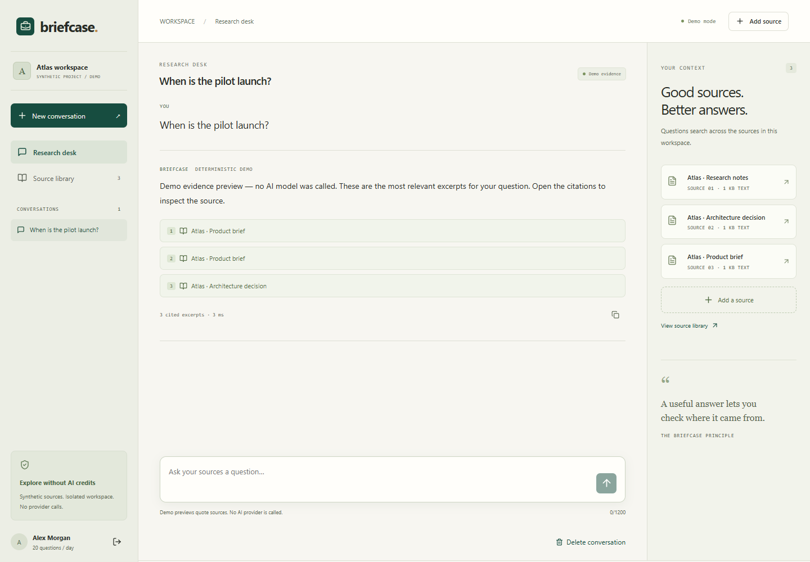
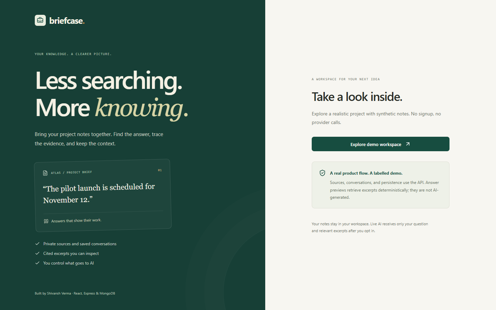
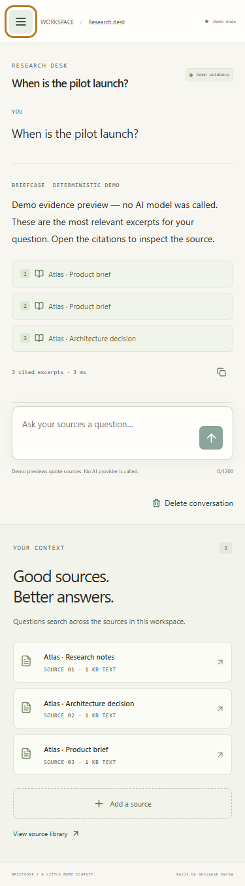

# Briefcase — answers with evidence

A private research workspace for engineers and product teams. Collect project notes, ask a question, inspect the quoted evidence, and return to saved conversations.

This upgrades MERN-gpt by Shivansh Verma. The coordinated API is [MERN-gpt-Backend](https://github.com/shivansh-verma13/MERN-gpt-Backend/tree/upgrade/briefcase-v2). Deploy matching `upgrade/briefcase-v2` revisions.

**Public deployment is pending.** The compiled same-origin release was verified locally with persisted synthetic data. Actual OpenAI output has not been verified with credentials.



<details><summary>Mobile workspace</summary>


</details>

## Product

- Isolated synthetic demo with three realistic project sources, explicitly labeled deterministic evidence previews. No AI model is called in demo mode.
- Private accounts when the API uses MongoDB and demo mode is disabled.
- Source library: search, paste, `.txt`/`.md` import, validation, inspection, confirmed deletion.
- Questions with inspectable citations, saved conversations, copying, cancellation, preserved questions on failure, confirmed deletion.
- Provider consent, safe text rendering, responsive cream/forest-green interface, keyboard focus, native dialogs, accessible mobile navigation, reduced motion.

## Stack and structure

React 18, strict TypeScript, Vite 7, plain CSS, Lucide. No router or large UI framework is needed for this single workspace.

```text
src/App.tsx            workspace navigation, source library, history
src/api.ts             same-origin requests, cookies, CSRF, errors
src/components/        Auth, Conversation, SourceDialog, Brand
src/styles.css         responsive design and accessible states
src/types.ts           API contracts
legacy/                old source, excluded from compilation
public/                favicon and preserved original assets
```

## Local setup

Node 22.12+, npm, and the paired API are required. The frontend needs no secret. Never put provider credentials in Vite variables.

```sh
npm ci
npm run dev
```

Run the API following its README, then open **http://localhost:5174**. Vite proxies `/api` to `127.0.0.1:5002`; use `localhost` to match the API's configured origin. `.env.example` explains this configuration.

```sh
npm run lint
npm run typecheck
npm test
npm run build
```

`npm run preview` uses port 4174. To connect it to the development API, change API `APP_ORIGIN` to `http://localhost:4174` and restart the API.

## AI behavior

The server retrieves up to five owner-scoped text excerpts, calls the official OpenAI Responses SDK, validates structured output, and checks each quoted citation against retrieved content. No tools or external actions are available. Only the question and relevant excerpts leave the workspace after consent; credentials and full conversation histories do not. `store:false` requests no response storage but does not guarantee zero provider retention.

Missing evidence produces abstention. Quote matching verifies provenance, not semantic entailment or perfect injection resistance. Lexical search can miss paraphrases. Demo results are explicitly evidence previews, not mocked intelligent answers. See the API README for quotas, token ceilings, cancellation, and evaluation limits.

## Deployment and documentation

Prefer one HTTPS origin serving API and built frontend via API `WEB_DIST`. [Deployment and recovery](docs/DEPLOYMENT.md) describes a new preview, database setup, migration, and rollback.

`netlify.toml` is a frontend scaffold: add a real `/api/*` reverse proxy before the SPA fallback. A static-only deployment cannot run the product. Do not overwrite the existing Portfolio site.

Read [verification](docs/VERIFICATION.md), [case study and portfolio copy](docs/CASE_STUDY.md), [priority backlog](docs/PROJECT_PRIORITY.md), and [upgrade log](UPGRADE_LOG.md).

## Limitations

Plain-text sources only; no PDF parsing, embeddings, source editing/sharing, password recovery, email verification, unchecked streaming, or agent actions. Live AI and public hosting remain unverified. Public live access needs additional account anti-abuse controls. Synthetic demo storage is capped at 200 workspaces and needs operator cleanup. Production requires persistent MongoDB, backups, monitoring, and one API replica until distributed locks are added.
